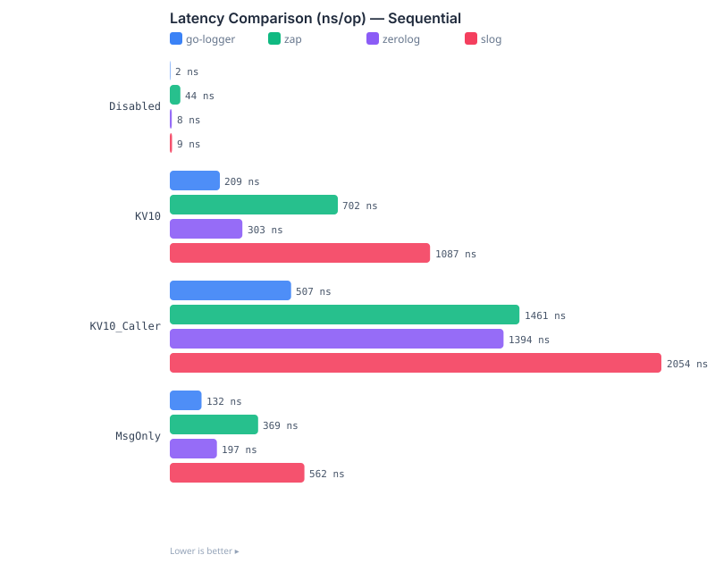
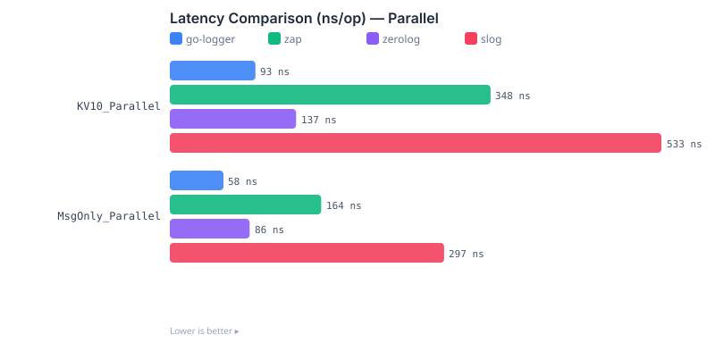
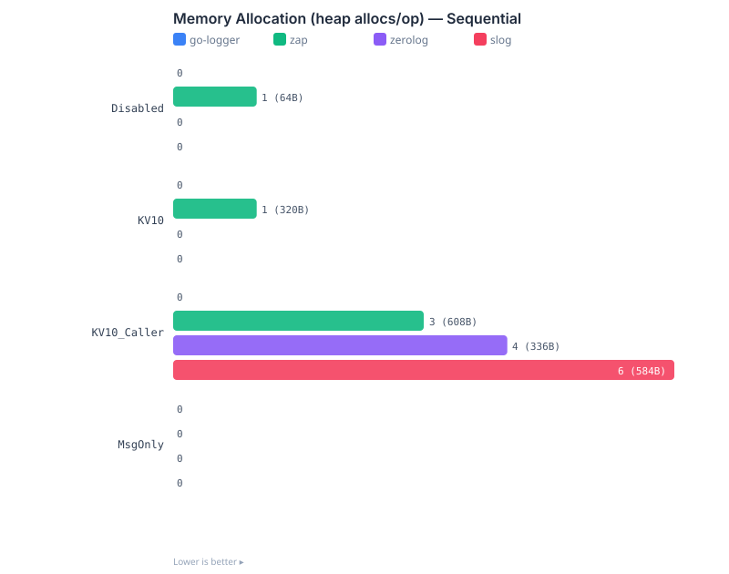
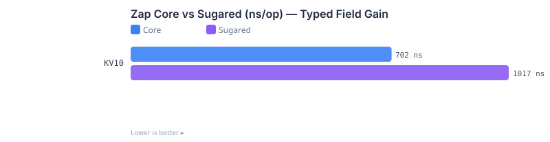

<div align="center">

# go-logger-benchmark

**Performance comparison between [go-logger], [zap], [zerolog] and [slog]**

[go-logger]: https://github.com/kamalyes/go-logger
[zap]: https://github.com/uber-go/zap
[zerolog]: https://github.com/rs/zerolog
[slog]: https://pkg.go.dev/log/slog

[](https://github.com/kamalyes/go-logger-benchmark/actions/workflows/benchmark.yml)

[中文文档](./README_zh.md)

</div>

---

## 📊 Benchmark Charts

### Latency — Sequential



### Latency — Parallel



### Memory Allocation — Sequential



### Zap Core vs Sugared — Typed Field Gain



> Charts are auto-generated on every push via GitHub Actions.

---

## 🧪 Scenarios

All scenarios share the same baseline: JSON format + Info level + `io.Discard` output, each library using its idiomatic API.

| Scenario | Description |
|----------|-------------|
| KV10 | 5 pairs (10 values) of mixed-type fields: 3 string + 2 int |
| KV10_Caller | KV10 with caller (source location) enabled |
| MsgOnly | Plain message without fields |
| Disabled | Level short-circuit: Debug below a WARN threshold |

Each scenario runs sequentially and in parallel (`-Parallel` suffix), plus a Zap Sugared variant to measure the typed-Field gain.

---

## 🚀 Quick Start

```bash
# Run all benchmarks
go test -run='^$' -bench=. -benchmem -count=3 -timeout=30m ./... | tee benchmark_output.txt

# Generate charts + BENCHMARKS.md
go run ./bootstrap/report

# Parse real benchmark output
go test -run='^$' -bench=. -benchmem -count=1 -timeout=10m ./... > benchmark_output.txt
go run ./bootstrap/report -parse benchmark_output.txt
```

---

## 📁 Project Structure

```bash
go-logger-benchmark/
├── bench_kv_test.go               # KV field benchmarks
├── bench_msg_test.go              # Plain message benchmarks
├── bench_disabled_test.go         # Level short-circuit benchmarks
├── loggers.go                     # Four-library aligned fixtures
├── bootstrap/
│   └── report/
│       ├── main.go                # Report + SVG chart generator
│       └── main_test.go           # Report parser unit tests
├── benchmarks/
│   ├── latency.svg                # Sequential latency chart
│   ├── latency_parallel.svg       # Parallel latency chart
│   ├── allocs.svg                 # Memory allocation chart
│   ├── zap_core_vs_sugared.svg    # Zap Core vs Sugared chart
│   └── *.json                     # Raw benchmark data
├── .github/workflows/
│   └── benchmark.yml              # CI auto-benchmark workflow
├── BENCHMARKS.md                  # Detailed data tables
└── go.mod
```

---

## ⚙️ CI Automation

The [benchmark workflow](./.github/workflows/benchmark.yml) runs automatically:

1. On every push to `master` (code changes only)
2. On `upstream-updated` dispatch when [go-logger] publishes a new tag

Each run executes `go test -bench` with 3 iterations against the pinned go-logger ref, generates SVG charts and commits them back to the repo as a single amended benchmark commit.

---

## 📋 Full Data

See [BENCHMARKS.md](./BENCHMARKS.md) for detailed comparison tables with all scenarios.

---

## 📝 License

This project is licensed under the MIT License.
